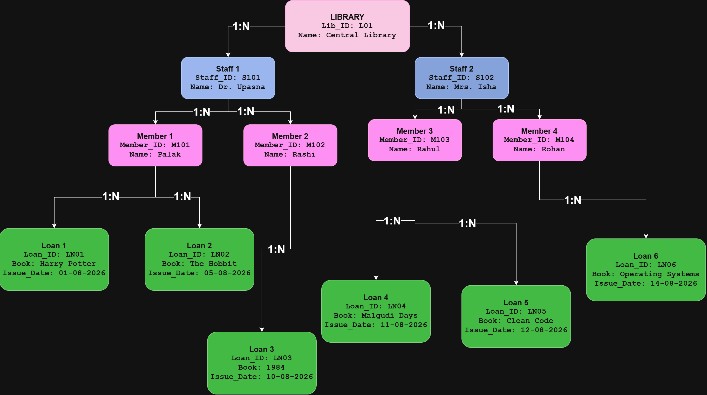
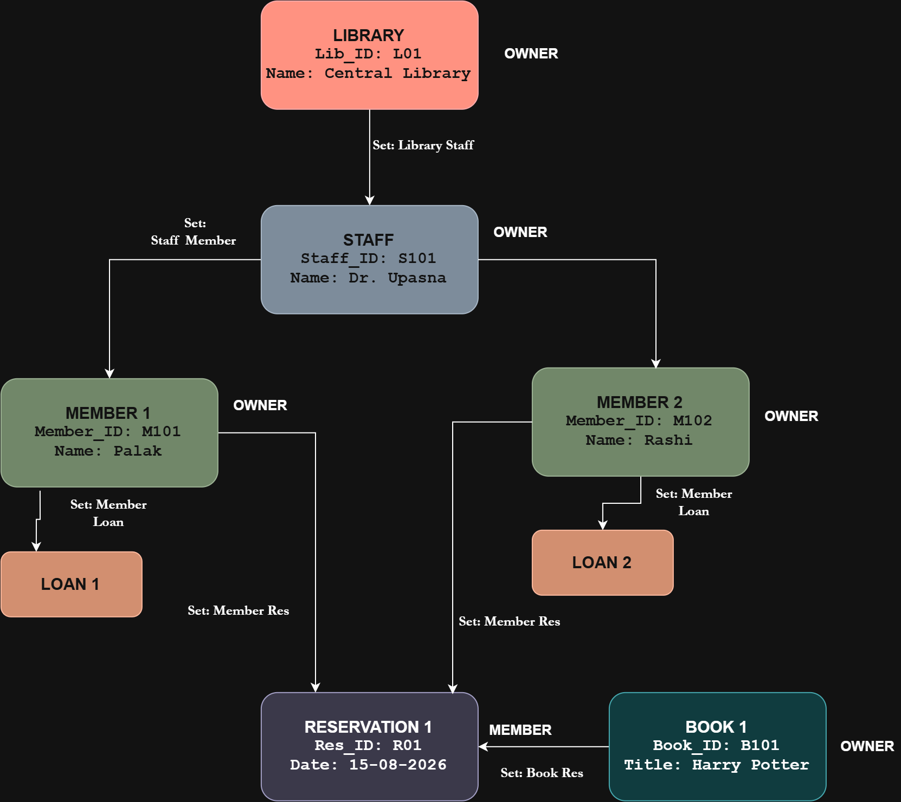

# DBMS Lab 1: Data Models (Hierarchical & Network)

---

## Question 1: Hierarchical Model (5 Marks)

### Diagram

---

### 1. Structure & Record Types
The Hierarchical Model organizes the database in a rigid, top-down tree structure. Every record type except the root has exactly one parent record type.

* **Root Level (Level 0)**: `LIBRARY`
  * Attributes: `Library_ID` (PK), `Library_Name`
* **Level 1**: `STAFF`
  * Attributes: `Staff_ID` (PK), `Staff_Name`, `Role`, `Library_ID` (FK)
* **Level 2**: `MEMBER`
  * Attributes: `Member_ID` (PK), `Member_Name`, `Staff_ID` (FK)
* **Level 3 (Leaf)**: `LOAN`
  * Attributes: `Loan_ID` (PK), `Book_Title`, `Issue_Date`, `Due_Date`, `Member_ID` (FK)

---

### 2. Parent-Child Relationships ($1:N$)
* **`LIBRARY` $\rightarrow$ `STAFF` ($1:N$)**: One Library employs multiple Staff members.
* **`STAFF` $\rightarrow$ `MEMBER` ($1:N$)**: One Staff member manages multiple Members.
* **`MEMBER` $\rightarrow$ `LOAN` ($1:N$)**: One Member can hold multiple Loan records (borrow multiple books).

---

### 3. Constraint Limitation ($1:N$ Single-Parent Restriction)
* **Single-Parent Constraint**: In a hierarchical database, a child node is restricted to having **only one parent node**.
* **Failure to Handle $M:N$ Relationships**: A real-world scenario often requires a **Many-to-Many ($M:N$)** mapping (e.g., a single **Book** being reserved by multiple **Members** over time).
* **Consequences**: Because a child node cannot point back to multiple parent nodes simultaneously in a tree structure, representing shared entities forces the system to duplicate data under every member record. This causes severe **data redundancy** and **update anomalies**.

---

---

## Question 2: Network Model (5 Marks)

### Diagram

---

### 1. CODASYL Owner-Member Set Relationships
The Network Model replaces rigid tree structures with a graph structure. Relationships are defined using explicit **Owner-Member Sets**, allowing child records (Members) to have multiple parent records (Owners).

| Set Name | Owner Record | Member Record | Cardinality | Purpose |
| :--- | :--- | :--- | :--- | :--- |
| **`Library-Staff`** | `LIBRARY` | `STAFF` | $1:N$ | Connects staff members to the library. |
| **`Staff-Member`** | `STAFF` | `MEMBER` | $1:N$ | Connects members to their managing staff. |
| **`Member-Loan`** | `MEMBER` | `LOAN` | $1:N$ | Connects loan transactions to members. |
| **`Member-Reservation`**| `MEMBER` | `RESERVATION` | $1:N$ | Connects members to their pending reservations. |
| **`Book-Reservation`** | `BOOK` | `RESERVATION` | $1:N$ | Connects books to active member reservations. |

---

### 2. Resolution of the Many-to-Many ($M:N$) Case
* **Problem**: In Question 1, representing a Many-to-Many ($M:N$) relationship between `BOOK` and `MEMBER` was impossible without duplicating records.
* **Solution**: The Network Model resolves $M:N$ relationships by introducing a **Junction Record Type** called **`RESERVATION`**.
* **Mechanism**:
  1. The direct $M:N$ relationship between `BOOK` and `MEMBER` is decomposed into two clean $1:N$ relationships.
  2. `RESERVATION` exists simultaneously as a **Member (Child)** in two separate sets:
     * **`Member-Reservation` Set** (Owner: `MEMBER`)
     * **`Book-Reservation` Set** (Owner: `BOOK`)
3. This setup allows multiple members to reserve multiple books efficiently without any data redundancy.

---

## Model Comparison

| Feature | Hierarchical Model (Q1) | Network Model (Q2) |
| :--- | :--- | :--- |
| **Data Structure** | Inverted Tree | Graph Network |
| **Parent Constraints** | Exactly 1 Parent per Child | Multiple Owners per Member |
| **$M:N$ Handling** | Unsupported (causes redundancy) | Supported via Junction Record (`RESERVATION`) |
| **Navigation Path** | Strict Root-to-Leaf | Flexible Pointer Traversal |
