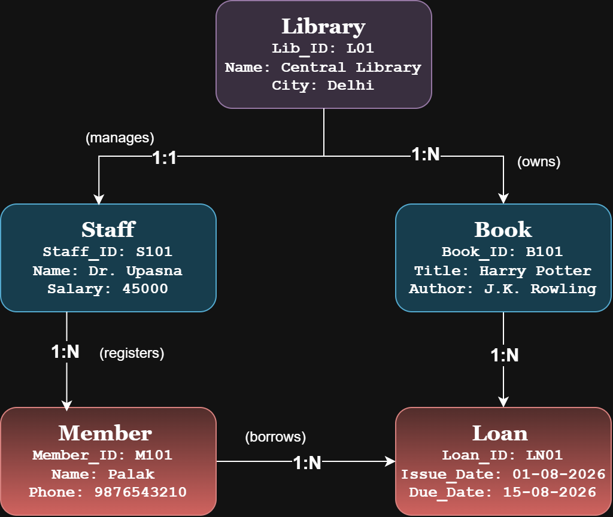
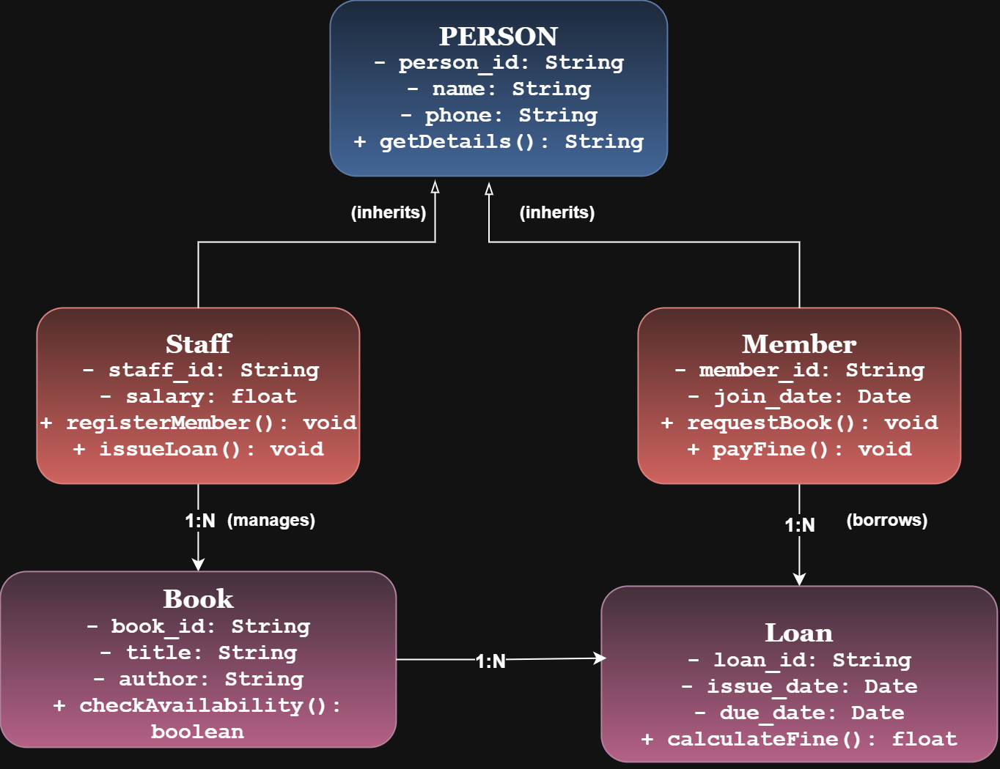

# Library Management System

This repository contains the **ER Model** and **Object-Oriented (OO) Class Diagram** for a Library Management System. The models represent the main entities, attributes, relationships, cardinalities, inheritance, and basic system operations.

## 📌 Question 1: ER Model

## 📊 ER Diagram



### Entities

The ER model contains the following entities:

* **LIBRARY** — `Lib_ID (PK), Name, City`
* **STAFF** — `Staff_ID (PK), Name, Salary`
* **MEMBER** — `Member_ID (PK), Name, Phone`
* **BOOK** — `Book_ID (PK), Title, Author`
* **LOAN** — `Loan_ID (PK), Issue_Date, Due_Date`

### Relationships

* **Library — Staff:** `Manages` — **1:1**
* **Library — Book:** `Owns` — **1:N**
* **Staff — Member:** `Registers` — **1:N**
* **Member — Book:** `Borrows` — **M:N**

The `M:N` borrowing relationship is represented using the **LOAN** entity:

* `MEMBER → LOAN` — **1:N**
* `BOOK → LOAN` — **1:N**

### Relational Schema

```text
LIBRARY(Lib_ID PK, Name, City)

STAFF(Staff_ID PK, Name, Salary, Lib_ID FK)

MEMBER(Member_ID PK, Name, Phone, Staff_ID FK)

BOOK(Book_ID PK, Title, Author, Lib_ID FK)

LOAN(Loan_ID PK, Issue_Date, Due_Date, Member_ID FK, Book_ID FK)
```

`PK` = Primary Key | `FK` = Foreign Key

---

## 📌 Question 2: OO Model

## 🏗️ OO Class Diagram



The OO model contains the following classes:

### Person

**Superclass**

* `person_id : String`
* `name : String`
* `phone : String`
* `getDetails() : String`

### Staff

**Inherits from Person**

* `staff_id : String`
* `salary : float`
* `registerMember() : void`
* `issueLoan() : void`

### Member

**Inherits from Person**

* `member_id : String`
* `join_date : Date`
* `requestBook() : void`
* `payFine() : void`

### Book

* `book_id : String`
* `title : String`
* `author : String`
* `checkAvailability() : boolean`

### Loan

* `loan_id : String`
* `issue_date : Date`
* `due_date : Date`
* `calculateFine() : float`

### Class Relationships

* **Staff → Person** — Inheritance
* **Member → Person** — Inheritance
* **Staff — Book** — `1:N` Association
* **Member — Loan** — `1:N` Association
* **Book — Loan** — `1:N` Association

---

## 📁 Files

```text
Library-Management-System/
├── ER_Model.png
├── OO_Model.png
└── README.md
```

## 🎯 Summary

The project demonstrates **ER modeling, relational schema mapping, primary and foreign keys, cardinalities, classes, methods, associations, and inheritance** for a Library Management System.
