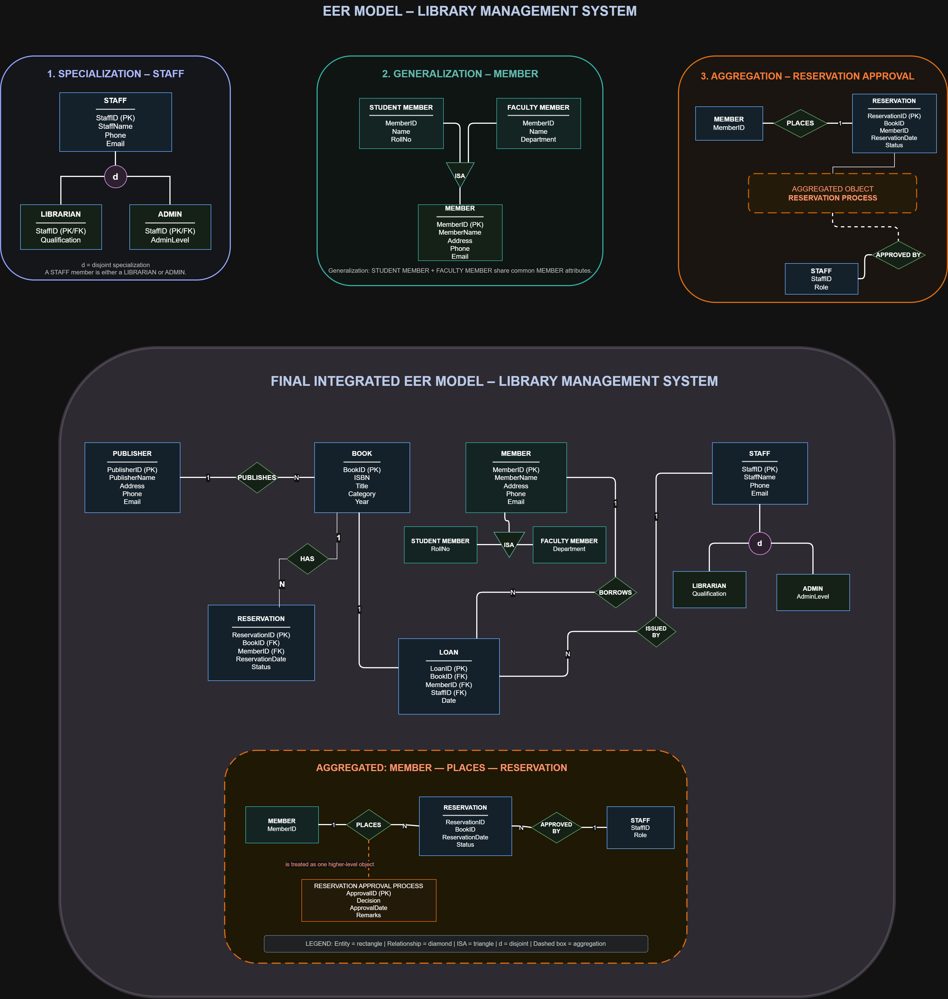
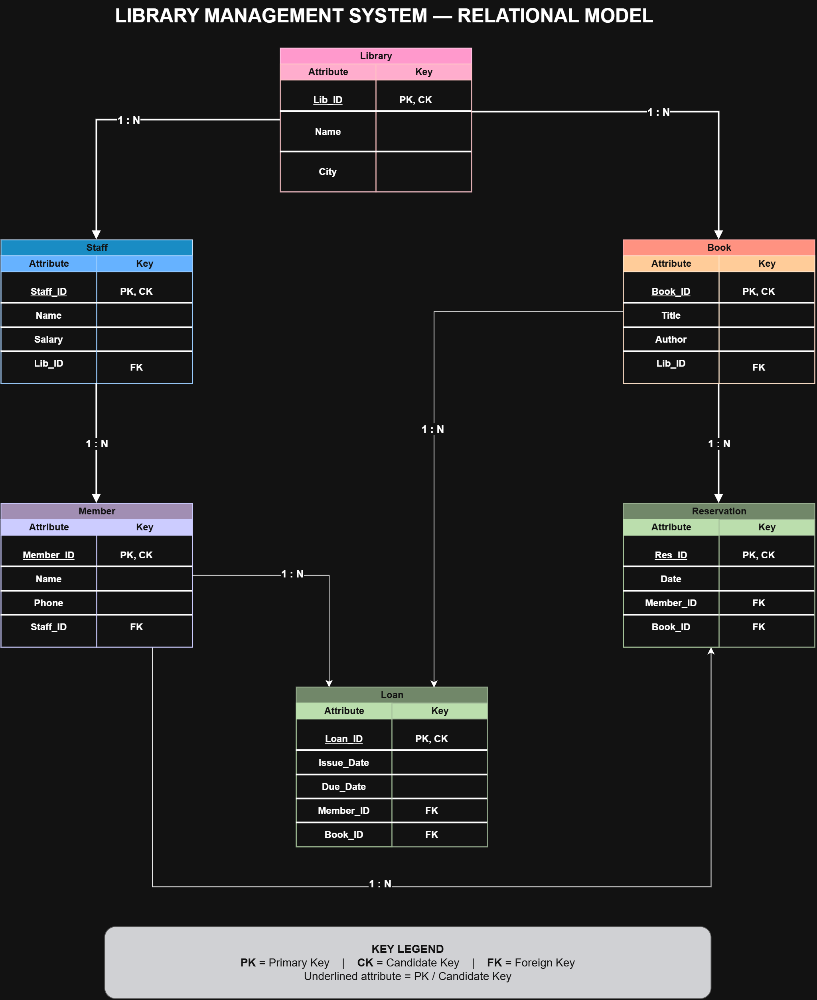

# 📚 Library Management System – Database Design

This repository contains the database design and modeling for a **Library Management System**.  
The project demonstrates the system using an **Enhanced Entity-Relationship (EER) Model** and its corresponding **Relational Model**.

## 📌 Project Overview

The Library Management System is designed to manage:

- Publishers and books
- Library members
- Student and faculty members
- Library staff
- Librarians and administrators
- Book loans
- Book reservations
- Reservation approval processes

The database design focuses on representing entities, relationships, keys, cardinalities, specialization, generalization, and aggregation.

---

## 🧩 1. Enhanced ER (EER) Model

The EER model extends the basic ER model using advanced concepts:

### Specialization
`STAFF` is specialized into:
- **LIBRARIAN**
- **ADMIN**

The `d` constraint represents **disjoint specialization**, meaning a staff member belongs to either Librarian or Admin.

### Generalization
`STUDENT MEMBER` and `FACULTY MEMBER` are generalized into the common superclass:

**MEMBER**

Common attributes such as MemberID, Name, Phone, and Email are represented at the MEMBER level.

### Aggregation
The relationship:

**MEMBER → PLACES → RESERVATION**

is treated as a higher-level **Reservation Approval Process**, which is associated with staff through the **APPROVED BY** relationship.

### EER Diagram

---

## 🗃️ 2. Relational Model

The EER design is mapped into relational tables using:

- Primary Keys (PK)
- Candidate Keys (CK)
- Foreign Keys (FK)
- One-to-Many (1:N) relationships

The main relations include:

- **Library**
- **Staff**
- **Book**
- **Member**
- **Loan**
- **Reservation**

### Relational Model Diagram

---

## 🔑 Key Concepts Used

| Concept | Purpose |
|---|---|
| PK | Uniquely identifies each record |
| CK | Candidate key that can uniquely identify records |
| FK | Establishes relationships between tables |
| ISA | Represents specialization/generalization |
| `d` | Represents disjoint specialization |
| 1:N | Represents one-to-many cardinality |
| Aggregation | Treats a relationship as a higher-level object |

---

## 🛠️ Tools Used

- **diagrams.net (Draw.io)** – Diagram creation
- **ER/EER Modeling** – Database design
- **Relational Schema** – Database mapping

---

## 🎯 Objective

The objective of this project is to design a clear and structured database model for a Library Management System while demonstrating both basic and advanced database modeling concepts.

---
